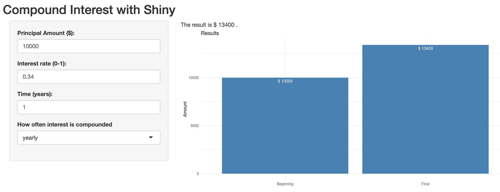

#Overview

This Compound Interest Calculator application was built for the Coursera Course: Developing Data Products as part of the Johns Hopkins Data Science Specialization.

The **shiny application link** can be found here: 

* https://selvstats.shinyapps.io/DDP_Week4_Project/ 

The code for the **ui.R** and **server.R** are available on my GitHub repo here: 

* https://github.com/ssendhil/DevelopingDataProducts 

#What the application looks like

{width=1000px}

#Compound interest formula

$$A = P \cdot  (1 + \frac{r}{n})^{nt}$$

* A = final amount
* P = principal (starting) amount
* r = interest rate 
* n = number of compoundings (annual = 1, semi-annual = 2, etc.)
* t = time (in years)

More info on compound interest is available here: https://www.purplemath.com/modules/expofcns4.htm

#Thank you.